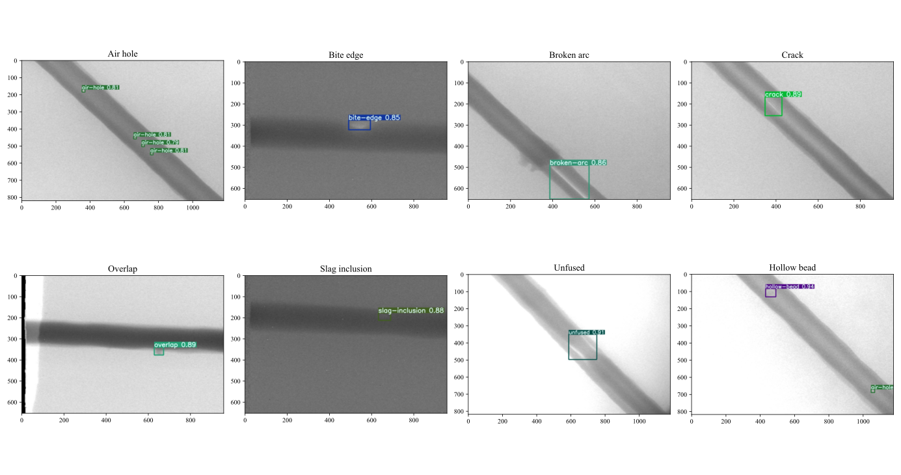
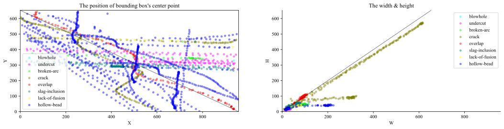

# Steel Pipe Weld Defect Detection

This repository contains the codes & dataset for the paper:
**Dingming Yang, Yanrong Cui, Zeyu Yu & Hongqiang Yuan. (2021). Deep Learning Based Steel Pipe Weld Defect Detection.** [[paper](https://doi.org/10.1080/08839514.2021.1975391)] [[arxiv](https://arxiv.org/abs/2104.14907)] [[code](https://github.com/huangyebiaoke/steel-pipe-weld-defect-detection)]




## Run Locally

Clone the project

```bash
git clone https://github.com/huangyebiaoke/steel-pipe-weld-defect-detection
```

Go to the project directory

```bash
cd steel-pipe-weld-defect-detection
```

Install dependencies

```bash
pip install -r requirements.txt
```

Download dataset from [Releases](https://github.com/huangyebiaoke/steel-pipe-weld-defect-detection/archive/refs/tags/1.0.zip) and unzip the file to the current directory

```bash
wget -O /steel-tube-dataset-all.zip https://github.com/huangyebiaoke/steel-pipe-weld-defect-detection/archive/refs/tags/1.0.zip
unzip steel-tube-dataset-all.zip
```

Start  training model
```bash
py ./yolov5/train.py
```


## Dataset

You can get the dataset from [Releases](https://github.com/huangyebiaoke/steel-pipe-weld-defect-detection/archive/refs/tags/1.0.zip) which with **YOLO** and **PASCAL VOC 2007** Format in the zip file.

### Sample distribution


| EN     | air-hole | bite-edge | broken-arc | crack | hollow-bead | overlap | slag-inclusion | unfused |
| ------ | -------- | --------- | ---------- | ----- | ----------- | ------- | -------------- | ------- |
| ZH     | 气孔     | 咬边      | 断弧       | 裂缝  | 夹珠        | 焊瘤    | 夹渣           | 未融合  |
| Label  | 0        | 1         | 2          | 3     | 4           | 5       | 6              | 7       |
| Number | 5191     | 35        | 458        | 119   | 229         | 223     | 120            | 408     |

### Dataset preview


### Dataset analysis




## Citation

If you use the code or dataset provided in this repository, please cite this work as follows:
```
@article{doi:10.1080/08839514.2021.1975391,
author = {Yang,Dingming and Cui,Yanrong and Yu,Zeyu and Yuan,Hongqiang},
title = {Deep Learning Based Steel Pipe Weld Defect Detection},
journal = {Applied Artificial Intelligence},
year = {2021},
doi = {10.1080/08839514.2021.1975391},
}
```


## Related work

[Reproduction of R-CNN](https://github.com/huangyebiaoke/R-CNN)

[Final assignment of data mining course](https://github.com/huangyebiaoke/data-mining-course/tree/main/final-assignment)


## License

[GPL-3.0](https://choosealicense.com/licenses/gpl-3.0/)


## Acknowledgements

 - [YOLOv5](https://github.com/ultralytics/yolov5)
 - [Reproduction of Faster R-CNN with Tensorflow2](https://github.com/bubbliiiing/faster-rcnn-tf2)